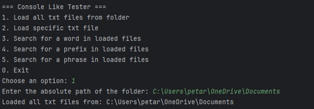
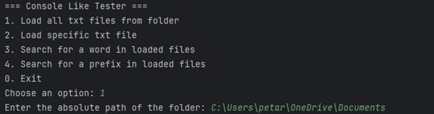
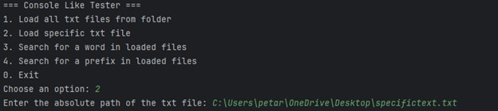
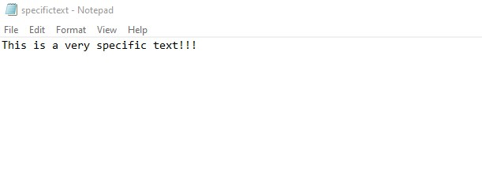
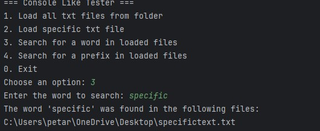
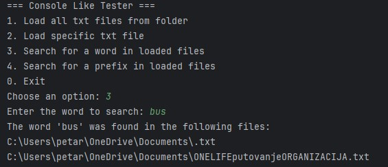

# Text File Searcher

This project is a Java-based console application that enables users to load multiple text files, either individually or from a folder, and search for specific words within these files. The program utilizes a Trie data structure for efficient word searching.

## Features

- **Load Single File**: Load a single text file into the application by specifying its file path.
- **Load Folder**: Load all `.txt` files from a specified folder.
- **Search Words**: Search for a word across all loaded files, displaying the names of files that contain the specified word.
- **Search Prefixes**: Search for a specific prefix across all loaded files, displaying the names of files that contain the words that contains that prefix.
- **Efficient Search**: Uses a Trie data structure to store words, optimizing search speed.

## Project Structure

- `TxtFile`: Represents a text file with its words loaded into a Trie.
- `TxtFileRegister`: Manages multiple `TxtFile` instances, allowing for efficient searching across files.
- `Trie`: Implements the Trie data structure for storing and searching words.
- `ConsoleLikeTester`: Console interface to interact with the `TxtFileRegister`.

## Project showcase picture by picture:

## Future improvements
I’d like to add the ability to search for phrases made up of multiple words, like "specific text." To achieve this, we could:

-**Store Phrases in the Trie:** Adjust the Trie to recognize spaces between words, allowing it to store multi-word phrases.

-**Match Whole Phrases:** Update the search so it can find complete phrases, not just single words, by checking each word in the phrase in sequence.

This would make it easy to search for exact phrases within the loaded text files.
