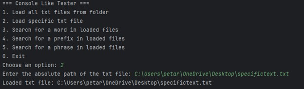
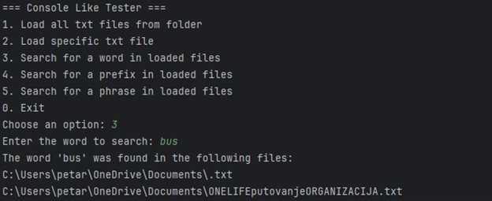
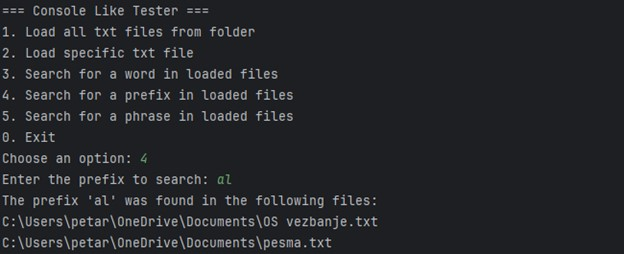
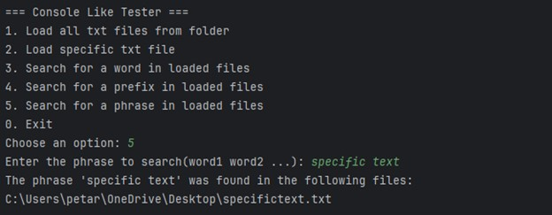

# Text File Searcher

This project is a Java-based console application that enables users to load multiple text files, either individually or from a folder, and search for specific words within these files. The program utilizes a Trie data structure for efficient word searching.

## Features

- **Load Single File**: Load a single text file into the application by specifying its file path.
- **Load Folder**: Load all `.txt` files from a specified folder.
- **Search Words**: Search for a word across all loaded files, displaying the names of files that contain the specified word.
- **Search Prefixes**: Search for a specific prefix across all loaded files, displaying the names of files that contain the words that contains that prefix.
- **Efficient Search**: Uses a Trie data structure to store words, optimizing search speed.

## Project Structure

- `TxtFile`: Represents a text file with its words loaded into a Trie.
- `TxtFileRegister`: Manages multiple `TxtFile` instances, allowing for efficient searching across files.
- `Trie`: Implements the Trie data structure for storing and searching words.
- `ConsoleLikeTester`: Console interface to interact with the `TxtFileRegister`.

## Project showcase picture by picture:

## Future improvements
I’d like to expand the functionality of the phrase search and add an state persistence:

**Advanced Phrase Search:** Currently, the phrase search checks for all words in a phrase separately. To make it more precise, I plan to enhance it to find exact phrases, ensuring that words appear in the correct order and close together in the text.

**State Persistence:** Add an option to enable or disable persistence, so the Trie state can be saved and reloaded across sessions when desired.
